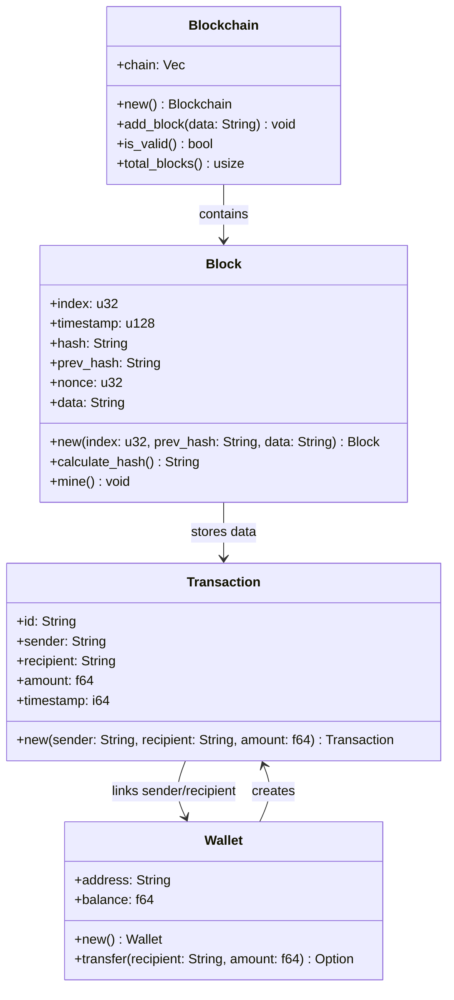

# 🚀 Rust Blockchain

A simple blockchain implementation in Rust featuring wallets, transactions, and a Proof-of-Stake (PoS) consensus mechanism.

## 🌟 Features

- **🔗 Blockchain Core**: A functional blockchain with blocks and transactions.
- **💰 Wallet System**: Generate and manage wallets with cryptographic key pairs.
- **💳 Transactions**: Secure peer-to-peer transactions between wallets.
- **⚡ Proof-of-Stake (PoS) Consensus**: A lightweight and efficient consensus mechanism.

## 🛠 Installation

Make sure you have Rust installed. If not, install it from [Rustup](https://rustup.rs/).

```sh
# Clone the repository
git clone https://github.com/yourusername/rust-blockchain.git
cd rust-blockchain

# Build the project
cargo build --release

# Run the blockchain node
cargo run
```

## 📊 Blockchain Architecture



